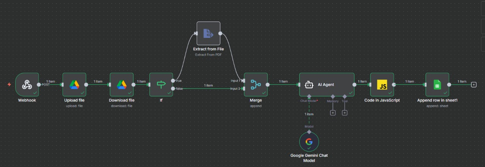

# **Proyecto Final – Introducción a la Inteligencia Artificial**

# **Sistema de Gestión Contable Automatizado con IA**

### **Integrantes del equipo:**

**Wilson Andres Henao,**
**Jean Schnneider Arias Suares y**
**Juan Esteban Jaramillo Cano**

### **Tecnologías utilizadas:**

Next.js · TypeScript · Supabase · LangChain · Google Gemini · n8n · Google Drive · Google Sheets

---

<div align="center">

## **Documento Técnico**

### **Asistente Contable Inteligente con Automatización y RAG**

#### *Optimización de procesos contables mediante IA generativa y flujos automatizados*

</div>

---

# **Contenido**

1. [Introducción](#-1-introducción)
2. [Problema a resolver](#-2-problema-a-resolver)
3. [Metodología](#-3-metodología)
4. [Arquitectura de agentes](#-4-arquitectura-de-agentes)
5. [Resultados y conclusiones](#-5-resultados-y-conclusiones)
6. [Trabajo futuro](#-6-trabajo-futuro)

---

# **1. Introducción**

Este proyecto presenta un **asistente contable automatizado con Inteligencia Artificial**, diseñado para procesar facturas, comprobantes de pago y documentos financieros, extraer su información relevante y registrarla automáticamente.

Además, incorpora un sistema **RAG (Retrieval-Augmented Generation)** que permite realizar consultas inteligentes sobre documentos cargados por el usuario.

El objetivo principal es **demostrar cómo la IA moderna puede integrarse en flujos contables reales**, reduciendo tiempos y errores.

---

# **2. Problema a resolver**

Los procesos contables manuales enfrentan dificultades como:

* Transcripción manual de datos desde facturas e imágenes.
* Errores humanos en los montos, fechas y cálculos.
* Tiempo perdido organizando documentos.
* Dificultad al buscar información en documentos antiguos.

Este proyecto busca **automatizar la extracción, registro y consulta de información contable**, creando un sistema inteligente completamente funcional.

---

# **3. Metodología**

## **1. Extracción de contenido**

* El usuario sube **PDFs, imágenes o documentos** desde la interfaz web.
* Dependiendo del tipo de proceso:

  * Gastos → Agente de Gastos (n8n)
  * Ingresos → Agente de Ingresos (n8n)
  * Documentos generales → Sistema RAG (Next.js)

Los PDFs se procesan mediante el endpoint `/api/rag/extract` o mediante nodos OCR en n8n.

---

## **2. División en chunks (Chunking)**

Los documentos del módulo RAG se fragmentan usando:

```
RecursiveCharacterTextSplitter
chunkSize: 1200
chunkOverlap: 200
```

Esto mejora la recuperación de contexto en las consultas del usuario.

---

## **3. Generación de embeddings**

Se crean vectores de cada chunk con:

```
GoogleGenerativeAIEmbeddings
model: "text-embedding-004"
```

Los embeddings y metadatos se guardan en **Supabase**.

---

##  **4. Arquitectura multiagente (n8n + Gemini)**

### **Agente Contable – Gastos**

* Recibe facturas
* Guarda el archivo en Drive
* Extrae texto
* Procesa con Gemini
* Limpia totales (JS)
* Registra en Google Sheets

### **Agente Contable – Ingresos**

* Recibe comprobantes de ingreso
* Guarda el archivo en Drive
* Extrae texto
* Procesa la información con Gemini
* Limpia totales mediante un script en JavaScript
* Registra los datos en Google Sheets (hoja *Ingresos*)
---

## **5. Interfaz en Next.js**

Incluye:

* Módulo para subir gastos
* Módulo para subir ingresos
* Chat activado por API key de Gemini
* Cargador RAG con vista previa PDF y barra de progreso
* **Historial de archivos procesados**, que muestra:

  * Nombre
  * Tipo de documento
  * Fecha de procesamiento
  * Estado
  * Icono visual de registro

---

# **4. Arquitectura de agentes**

Esta sección describe en detalle cómo funciona el sistema por dentro:

* Cómo se comunican los agentes en **n8n**
* Cómo trabajan los flujos de **Gastos** e **Ingresos**
* Cómo interviene **Gemini** en la extracción estructurada
* Cómo opera **LangChain** para el módulo **RAG**
* E incluye espacios para agregar las imágenes de los flujos reales de n8n.

---

# **4.1 Arquitectura de n8n – Agentes Contables**

El proyecto utiliza dos agentes principales dentro de **n8n**, ambos con la misma estructura de nodos, cambiando únicamente el *prompt contable*:

* **Agente Contable de Gastos**
* **Agente Contable de Ingresos**

Ambos agentes siguen el mismo pipeline:

1. **Webhook**
   Recibe el archivo enviado desde la interfaz de Next.js.

2. **Google Drive – Subida de Archivo**
   El documento se almacena automáticamente en la carpeta definida para el sistema contable.

3. **Google Drive – Descargar Archivo**
   Se descarga inmediatamente la copia subida para poder procesarla.

4. **Extracción de texto**

   * Si es PDF → se usa el nodo “Extract from File”
   * Si es imagen → n8n hace OCR interno
     De ambas formas se obtiene texto plano.

5. **LangChain + Gemini**
   Un nodo de LangChain envía el texto y el prompt contable a Gemini, solicitando:

   * Número de factura
   * Fecha
   * Emisor
   * Total
   * Impuestos
   * Descripción estructurada

6. **Limpieza del total (JS)**
   Un nodo de JavaScript normaliza el número:

   * Elimina puntos/espacios
   * Convierte coma decimal
   * Genera valor numérico en pesos colombianos

7. **Google Sheets – Registrar información**
   El sistema agrega una fila nueva en:

   * Hoja *Gastos*
   * Hoja *Ingresos*
     según corresponda, junto con el link al archivo en Google Drive.

---

## **4.1.1 Diagrama del flujo n8n (Gastos e Ingresos)**

```
[Webhook (Next.js)]
        │
        ▼
[Google Drive: Upload]
        │
        ▼
[Google Drive: Download]
        │
        ▼
[Extract Text (PDF/Image)]
        │
        ▼
[LangChain + Gemini]
        │
        ▼
[JS: Clean Total]
        │
        ▼
[Google Sheets: Append Row]
        │
        ▼
     FIN
```

---

## **4.1.2 Cisualizacion de agentes en n8n**


### **Agente de Gastos – n8n**



[Ver archivo .json](AgentecontableGASTOS.json)


---

### **Agente de Ingresos – n8n**


[Ver archivo .json](AgentecontableINGRESOS.json)

---

# **4.2 Arquitectura del Sistema RAG – Cómo interviene LangChain**

El módulo RAG permite subir documentos (PDF o texto) y convertirlos en conocimiento vectorizado que puede usarse para responder preguntas contextualizadas.

### Esto involucra:

* Lectura del archivo desde el navegador
* Extracción de texto (PDF → `/api/rag/extract`)
* División del contenido (chunking)
* Generación de embeddings con **LangChain + Gemini**
* Envío de vectores a la BD de Supabase
* Uso posterior para consultas

Aquí tienes una explicación detallada basada en el archivo `UserRagUploader.tsx`.

---

## **4.2.1 Flujo técnico del RAG**

### **1. Subida del archivo**

El usuario selecciona un PDF o TXT desde un Drawer en Next.js.

### **2. Extracción de texto**

* Si es PDF → el archivo se envía a `/api/rag/extract` donde se procesa.
* Si es texto → se lee directamente con `TextDecoder()`.

### **3. Chunking (fragmentación)**

El archivo se divide usando:

```ts
const splitter = new RecursiveCharacterTextSplitter({
  chunkSize: 1200,
  chunkOverlap: 200
});
```

Esto asegura que los embeddings mantengan coherencia semántica.

### **4. Generación de embeddings**

Se usa el modelo de Google:

```ts
new GoogleGenerativeAIEmbeddings({
  apiKey,
  model: "text-embedding-004"
});
```

Se generan dos tipos de embeddings:

* **Query embedding** (para validar dimensión)
* **Document embeddings** (uno por cada chunk)

### **5. Envío en lotes al backend**

Para eficiencia, el sistema envía chunks en grupos de 100:

```ts
const batchSize = 100;
```

Cada lote incluye:

* Texto del chunk
* Embedding numérico
* `document_id`

### **6. Almacenamiento en Supabase**

El backend guarda:

* Documentos
* Metadatos
* Chunks
* Embeddings vectoriales

Supabase funciona como base de datos vectorial para consultas posteriores.

---

## **4.2.2 Diagrama de funcionamiento de LangChain**

```
                    ┌─────────────────────────────┐
                    │   Usuario sube documento     │
                    └───────────────┬──────────────┘
                                    │
                            [Next.js Frontend]
                                    │
                     ┌──────────────┴──────────────┐
                     │                             │
             Si es PDF → /api/rag/extract      Si es TXT → lectura directa
                     │                             │
                     └──────────────┬──────────────┘
                                    ▼
                    [LangChain Text Splitter]
               (Chunking: 1200 chars con 200 overlap)
                                    │
                                    ▼
                       [LangChain Embeddings]
                (Google Gemini – text-embedding-004)
                                    │
                       Embeddings por lote (100)
                                    │
                                    ▼
                          [API /api/rag/ingest]
                                    │
                                    ▼
                         [Supabase Vector Store]
                                    │
                                    ▼
                  Consultas futuras con búsqueda semántica
```


---

#  **5. Resultados y conclusiones**

## **Resultados logrados**

* Sistema completamente funcional desde carga → extracción → registro.
* Integración real con:

  * Google Drive
  * Google Sheets
  * Supabase
  * Gemini
  * n8n
* Historial visual de archivos procesados.
* Sistema RAG operativo para consultas inteligentes.
* Cargador con barra de progreso y vista previa.

---

## **Conclusiones**

* La IA generativa puede automatizar tareas contables de forma confiable.
* n8n facilita la construcción de agentes empresariales reales.
* El uso de chunking + embeddings mejora drásticamente la calidad de las respuestas del asistente.
* El historial permite transparencia y trazabilidad.

---

#  **6. Trabajo futuro**

* Añadir autenticación de usuarios.
* Panel de estadísticas (gastos/ingresos por mes).
* Notificaciones por correo cuando el archivo sea procesado.
* OCR avanzado para facturas borrosas.
* Integración del RAG con el chat contable.
* Exportación mensual automática en PDF.
* Modo multiempresa.

---

